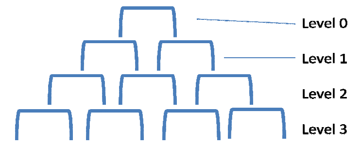

# Пирамида

Представим, что у нас есть пирамида, выстроенная из П-образных элементов, как на рисунке:

Масса каждого из П-образных элементов 50 кг.

Задачи:

## 1

Имплементируйте функцию getHumanEdgeWeight(level, index). Функция должна возвращать значение массы, которую «несет»  на своей верхней (горизонтальной) грани соответствующий элемент на соответствующем уровне.  

level – номер уровня пирамиды.  

index – номер элемента внутри уровня.

## 2

Имплементируйте простой HTTP-сервер на основе Netty (http://netty.io), который сможет обрабатывать обращение к ресурсам:  
  
А) GET/weight?level={level}&index={index}  
B) GET /weight/{level}/{element}

Обращения к этим ресурсам должны возвращать результат работы функции getHumanEdgeWeight для переданных значений level и index (используйте text/plain в качестве content-type для response).

Будьте готовы, что клиенты могут передавать некорректные значения параметров или обращаться к несуществующим ресурсам. Вы должны отвечать на такие запросы корректно с точки зрения HTTP-протокола.

Будьте готовы к нагрузочному тестированию (~10^2 одновременных запросов, ~10^3 запросов в секунду).

## 3

Используйте IoC-контейнер(Spring/Guice/etc.) для «связывания» следующих слоев:
- http-уровень (реализованный с использованием Netty)
- сервисный уровень, который обеспечивает доступ к определенной реализации алгоритма getHumanEdgeWeight
- конкретную реализацию алгоритма getHumanEdgeWeight

## 4

Используйте Maven (http://maven.apache.org) для сборки исполняемого JAR-файла. При запуске Вашего JAR-файла должен стартовать Ваш http-сервер, который должен обрабатывать обращения клиентов на порт 8080.